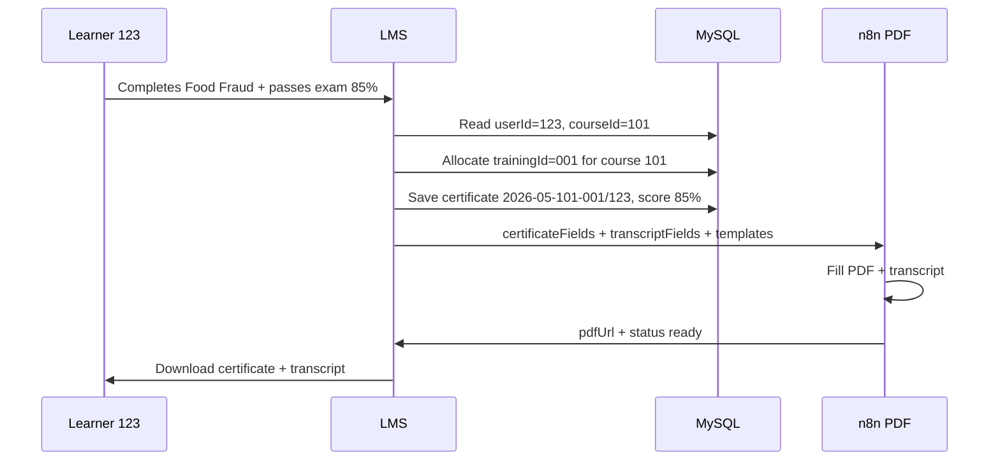

# SFT certificate ID system — how it works (sketch)

Read this before n8n or grade rules. It matches your example: **one person, two courses, same user ID, different course + training IDs.**

---

## The four levels (top → bottom)

```
Category  →  Course  →  Training (completion)  →  User (learner)
  ESG         101         001 (1st issue)          123
  Food        102         001 (1st issue)          123
  Cyber       103         002 (2nd person on 103)  456
```

| Level | What it is | Who gets the ID | Changes when? |
|-------|------------|-----------------|---------------|
| **Category** | ESG, Food Safety, Cybersecurity… | Each category in admin | Never (marketing grouping) |
| **Course ID** | One self-paced program (e.g. Food Fraud, Cyber Security) | Each course in MySQL `lms_course` | Never — starts at **101**, then 102, 103… |
| **Training ID** | One **issued certificate** for that course (which completion / which issue) | Each time someone earns that course’s certificate | **Different per course**; for the same course, increments 001, 002, 003… |
| **User ID** | The learner (SFT delegate number) | Each person at registration | **Never** — same person keeps **123** for all courses |

**Category** is not inside the certificate number today — it is shown on the PDF as **course name** and stored as `course.category` (e.g. `Food Safety`, `ESG`).

---

## Your example — user **123** completes two courses

| | Food Fraud course | Cyber Security course |
|---|-------------------|------------------------|
| Category | Food Safety | Cybersecurity |
| **Course ID** | `101` | `102` |
| **Training ID** | `001` (first certificate issued for course 101 that month) | `001` (first for course 102) |
| **User ID** | `123` | `123` (same person) |
| **Certificate number** | `2026-05-101-001/123` | `2026-05-102-001/123` |
| **Delegate number** | `123` | `123` |

Same learner, **two different certificate numbers** because **course ID** (and training context) changed.

If another learner (user **124**) completes Food Fraud in the same month:

| | Value |
|---|--------|
| Course ID | `101` |
| Training ID | `002` (second issue for course 101) |
| User ID | `124` |
| Certificate number | `2026-05-101-002/124` |

---

## Delegate number (certificate tracker + QR)

Used on the PDF as **Unique Delegate No.** and encoded in the **QR code**.

```
YYYY-{verifyNumber}-{userId}
```

Example: **`2026-0042-123`**

| Part | Meaning |
|------|---------|
| `2026` | Year certificate issued |
| `0042` | Global verify sequence that year (each new certificate +1) |
| `123` | Learner user ID (same person on every course) |

**QR / verify link:** `https://your-lms.com/certificates/verify?delegate=2026-0042-123`

Anyone scanning the QR sees verified learner, course, grade, issue date — and can **Share on LinkedIn**.

---

## Certificate number (legal reference on PDF)

```
YYYY-MM-{courseId}-{trainingId}/{userId}
```

| Part | Meaning | Example |
|------|---------|---------|
| `YYYY-MM` | Year and month certificate is **issued** | `2026-05` |
| `courseId` | Permanent course ID (MySQL) | `101`, `102` |
| `trainingId` | Issue sequence for **that course** in **that month** (`001`, `002`…) | `001` |
| `userId` | Learner registration ID (delegate number) | `123` |
| `123-org` | Organisation account suffix | optional |

---

## Where each ID is saved (MySQL)

| ID | Table / field | When set |
|----|---------------|----------|
| User ID | `lms_user.identificationNumber` | First registration (101, 102…) |
| Course ID | `lms_course.courseIdentificationNumber` | First time course is saved to MySQL |
| Training ID | Inside `lms_certificate.certificateNumber` | When certificate is issued |
| Full certificate number | `lms_certificate.certificateNumber` | Same moment |
| Grade (score) | `lms_certificate.scorePercent` | From final exam |
| Category label | `lms_course.category` | Admin course setup |

One row in **`lms_certificate`** per learner **per course** (user 123 + food course = one row; user 123 + cyber = another row).

---

## What goes on the PDF vs what is only in the database

### Certificate PDF (changes per issue)

| Field | Source |
|-------|--------|
| Candidate name | User profile |
| Course name | Course title (shows category topic, e.g. ESG / Food) |
| Duration, mode, issue date | Course + issue date |
| Certificate number | Formula above |
| Unique delegate number | **User ID** (`123`) |

### Transcript PDF (changes per issue)

| Field | Source |
|-------|--------|
| Name | Same as certificate |
| Training program | Course title |
| **Grade** | See grade rules below |
| Certificate number + issue date | Same as certificate |

---

## Grades — how you will control them

Today the LMS stores **exam score %** (`scorePercent`). You can show on the transcript as **percent** or **letter**.

### Option A — Letter grade from score (recommended)

Admin defines bands once (global or per course later):

| Score | Letter |
|-------|--------|
| 90–100 | A |
| 80–89 | B |
| 70–79 | C |
| 60–69 | D |
| Below 60 | Fail (no certificate) |

**Flow**

1. Learner passes final exam → LMS saves `scorePercent` (e.g. `87`).
2. LMS maps to letter → `B`.
3. n8n receives `transcriptFields.grade`: `"B"` or `"87% (B)"` — you choose display format.

### Option B — Percent only

`transcriptFields.grade`: `"87%"`

### Option C — Admin override

In **Admin → course → Students** (or certificate approvals): manually set grade for one learner before allowing download.

### What we will add in LMS (next step)

- [ ] `gradeLetter` computed from `scorePercent` using your bands
- [ ] Optional admin setting: `gradeDisplay`: `letter` | `percent` | `both`
- [ ] Optional per-course pass threshold (already on final exam: e.g. 60%)

You tell us which option (A/B/C) and the exact bands — we wire it once for all courses.

---

## End-to-end flow (one learner, one course)



---

## Checklist for you

- [ ] Category names in admin match how you want them on marketing (ESG, Food, Cyber…) — **course title** goes on the certificate, not category ID.
- [ ] Each course synced to MySQL has a **course ID** (101, 102…).
- [ ] Each registered learner has a **user ID** (101, 102… — your delegate number).
- [ ] Decide grade display: **letter**, **percent**, or **both**.
- [ ] Send grade band table (e.g. 90+ = A) when ready.

After you confirm grades + bands, we implement `gradeLetter` in the webhook payload and update n8n to print it on the transcript.
