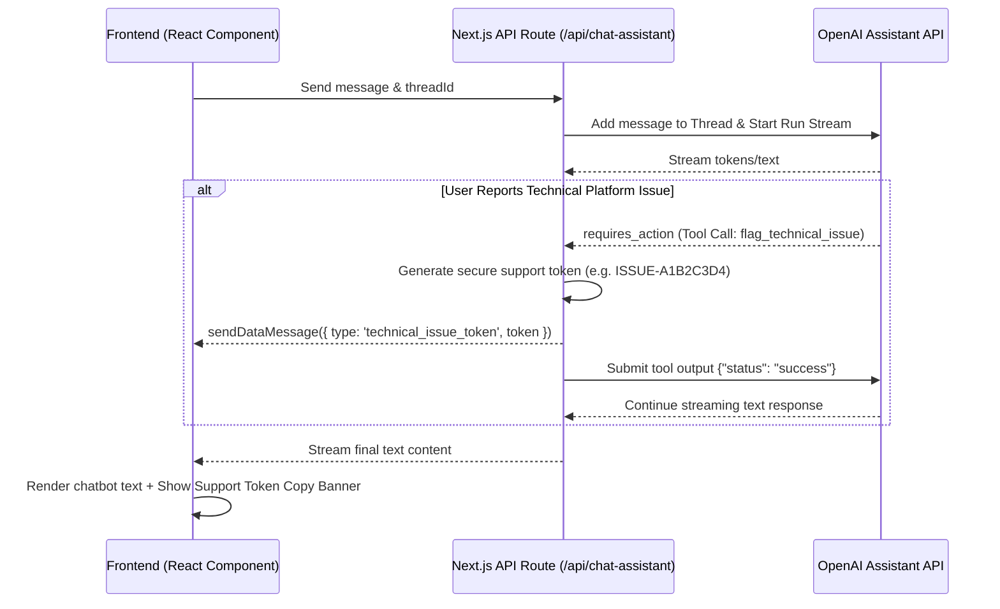

# OpenAI Assistant Chatbot Integration with Platform Support Token Generation

This guide explains how the chatbot feature is implemented in this Next.js project using **OpenAI Assistants**, the **Vercel AI SDK**, and **Function Calling (Tools)** to detect when a user reports a platform technical issue (e.g., website not loading, video player not working, login issues) and generate/extract a secure support token.

---

## Architecture Overview



---

## Step 1: Set up the OpenAI Assistant

1. Go to the [OpenAI Developer Platform](https://platform.openai.com/assistants).
2. Click **Create** to create a new Assistant.
3. Configure the settings:
   - **Name**: Course & Platform Assistant
   - **Instructions**: 
     ```text
     You are a helpful AI Assistant for Sustainable Futures Trainings. 
     Your job is to answer questions about the course details, schedules, pricing, level, and curriculum using the uploaded files/vector store.
     
     If a user reports or asks about a technical issue/bug with the LMS platform itself (for example: videos not loading, buttons not clicking, login issues, checkout/cart errors, page crashes, database issues, or zoom link not syncing), you MUST call the "flag_technical_issue" tool immediately before responding.
     ```
   - **Model**: `gpt-4o` or `gpt-4-turbo`.
4. **Enable Tools**:
   - Turn on **File Search** (upload the generated `data/knowledge-base.md` or catalog files to its vector store).
   - Add a custom **Function** (tool) under the Tools section:
     ```json
     {
       "name": "flag_technical_issue",
       "description": "Trigger this tool if the user reports a technical issue or bug on the LMS platform, such as video playback issues, login failures, broken links, or system errors.",
       "parameters": {
         "type": "object",
         "properties": {
           "description": {
             "type": "string",
             "description": "A description of the technical issue reported by the user."
           }
         },
         "required": ["description"]
       }
     }
     ```
5. Copy the **Assistant ID** (starts with `asst_...`).

---

## Step 2: Environment Variables

Add the following environment variables to your `.env.local` file (do not commit this file):

```env
# OpenAI API Settings
OPENAI_API_KEY=your_openai_api_key_here
OPENAI_ASSISTANT_ID=asst_your_assistant_id_here
```

---

## Step 3: Files Created

The integration consists of three main parts:

### 1. Backend API Route: `app/api/chat-assistant/route.ts`
- Receives the message and thread ID.
- Automatically creates new threads and submits messages.
- Streams the Assistant's response to the client.
- Intercepts the `flag_technical_issue` tool call, generates a unique support token, streams it to the client using the Vercel AI SDK's `sendDataMessage`, and submits the tool output to resume the run.

### 2. Chatbot Component: `components/CourseChatbot.tsx`
- A floating chat panel styled to match the dark/gold premium theme of the SFT platform.
- Connects using the Vercel AI SDK's `useAssistant` hook.
- Listens to incoming data messages and catches the custom `technical_issue_token` event.
- Displays a dedicated copyable token banner at the bottom of the window if an issue is logged.

### 3. Shell Mounts
The chatbot is mounted in both:
- `components/SelfPacedCourseShell.tsx` (for self-paced course details)
- `components/TutorLedProgramClient.tsx` (for live program details)

---

## How Technical Support Tokens are Extracted

1. When a user sends a message like *"The video player won't start on unit 2"*:
2. The OpenAI Assistant identifies it as a platform technical issue and fires the tool:
   ```json
   { "name": "flag_technical_issue", "arguments": { "description": "The video player won't start on unit 2" } }
   ```
3. The Next.js backend catches this, creates a token (e.g. `ISSUE-8F3K9S4B`), and sends it down the stream:
   ```ts
   sendDataMessage({
     role: "data",
     data: {
       type: "technical_issue_token",
       token: "ISSUE-8F3K9S4B",
       issueDescription: "..."
     }
   });
   ```
4. The client component (`CourseChatbot.tsx`) monitors incoming data messages:
   ```ts
   useEffect(() => {
     const lastMessage = messages[messages.length - 1];
     if (lastMessage && lastMessage.role === "data") {
       const dataObj = lastMessage.data as any;
       if (dataObj && dataObj.type === "technical_issue_token") {
         setLatestToken({ token: dataObj.token, query: dataObj.issueDescription || "" });
       }
     }
   }, [messages]);
   ```
5. You can copy the token, or programmatically trigger other workflows on the client (like registering a support ticket in Zendesk/Jira or logging the issue in your database).
